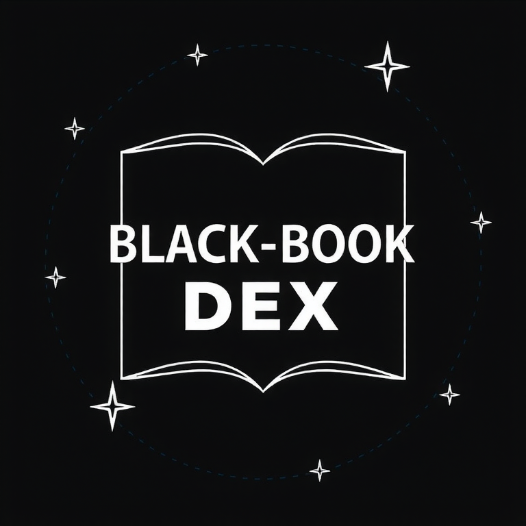
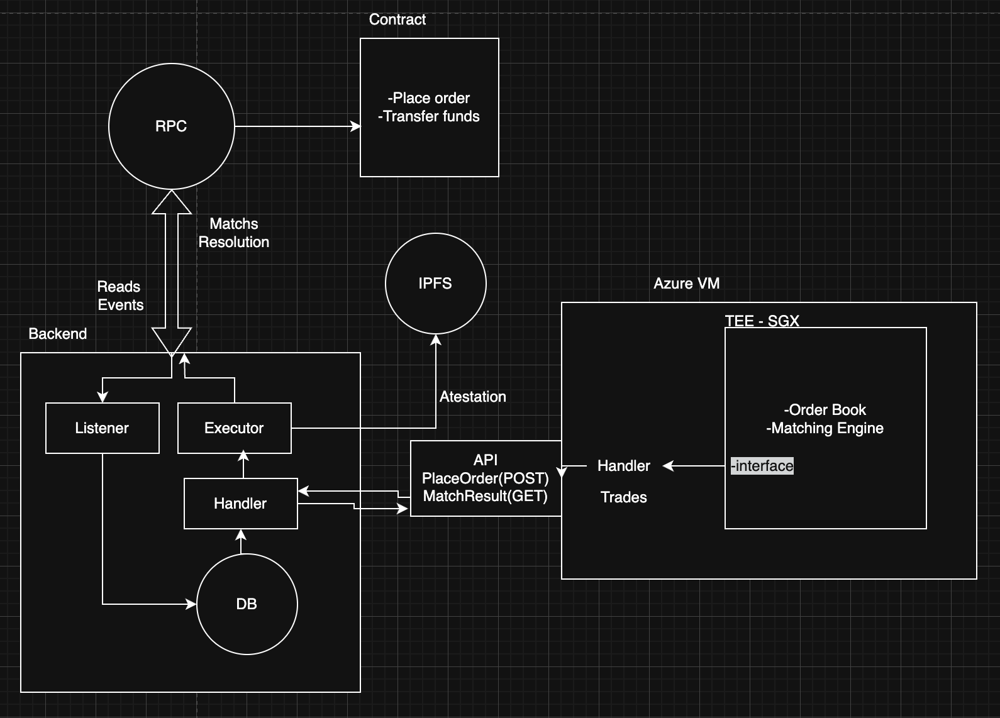

# 🔐 DexTrustEE 🔄

## Secure Decentralized Exchange with Trusted Execution Environments

DexTrustEE combines the transparency of blockchain with the privacy of secure enclaves to create a revolutionary decentralized exchange platform. Our solution leverages Intel SGX (Software Guard Extensions) technology to execute trades in a trusted and secure environment.

## ✨ Key Features

- 🔒 **Secure Trade Execution**: Orders processed in trusted SGX enclaves
- 🌐 **On-chain Settlement**: All transactions settled transparently on Ethereum
- 💰 **Multi-asset Support**: Trade with ETH and ERC-20 tokens
- ⚡ **Fast Order Processing**: Efficient off-chain order matching
- 🛡️ **Privacy-Preserving**: Order details protected until execution

## 🏗️ Architecture

DexTrustEE consists of three main components:

1. **Smart Contracts**: Handle deposits, withdrawals, and settlement on-chain
2. **Event Listener**: Monitors blockchain for new orders and other events
3. **Secure Enclave**: Executes trades in a trusted environment using Intel SGX
4. **On chain settlement**: Settles trades on-chain

## 💡 Built at ETH Global

DexTrustEE was developed during ETH Global hackathon, combining the best of blockchain technology with trusted execution environments to solve real-world problems in decentralized finance.

## 📄 License

MIT 